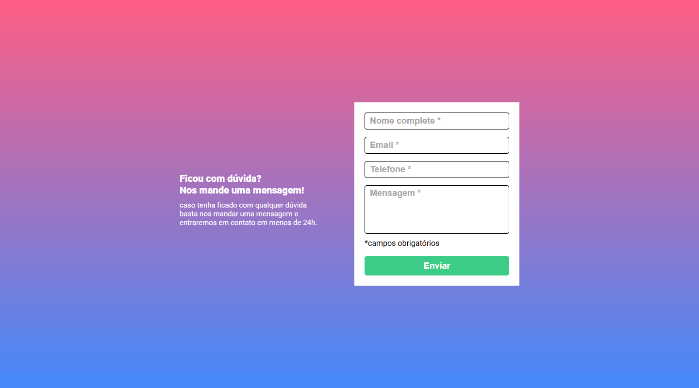
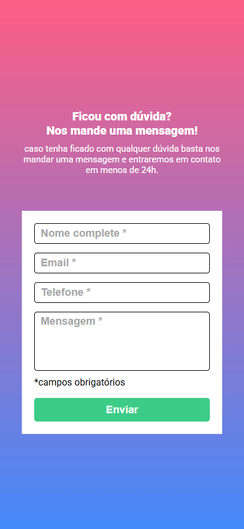

# Validation Form


## 📌 Sobre o Projeto

Este repositório contém um desafio intermediários de **HTML, CSS e JavaScript**, desenvolvido como parte do processo de aprendizado e prática na construção de aplicações web.

Este projeto inclui um **formulário interativo**, que possui:
- **Validação de campos**: impede o envio quando há campos obrigatórios vazios.
- **Feedback visual**: destaca os campos válidos e inválidos para orientar o usuário.

O objetivo é reforçar conceitos fundamentais e explorar técnicas avançadas no desenvolvimento front-end.

## 📸 Capturas de Tela

### 🖥️ Versão Desktop  


### 📱 Versão Mobile  


## 🚀 Tecnologias Utilizadas

O projeto utiliza as seguintes tecnologias:
- **HTML5** → Estruturação do conteúdo da página
- **CSS3** → Estilização e layout responsivo
- **JavaScript** → Interatividade e manipulação do DOM
- **Figma** → Referência para leitura do design

## 🔧 Como Executar o Projeto

1. **Clone o repositório:**
   ```bash
   git clone https://github.com/JottaCa/quest-html-css-js-intermediario.git
   ```
2. **Acesse a pasta do projeto:**
   ```bash
   cd quest-html-css-js-intermediario
   ```
3. **Abra o arquivo `index.html` no navegador:**
   - Você pode abrir manualmente ou utilizar um servidor local, como a extensão Live Server no VS Code.
4. **Ou acesse a versão online do projeto diretamente pelo GitHub Pages:**
    - 👉 [Clique aqui para visualizar](https://jottaca.github.io/quest-html-css-js-intermediario/)

## 📂 Estrutura de Pastas

```
validation-form/
│── src/            # Pasta de mídias, estilos e js
|    |── css/       # Arquivos de estilos (CSS)
|    |── images/    # Imagens do projeto
|    |── js/        # Scripts JavaScript
│── index.html      # Página principal do projeto
└── readme.md       # Documentação do projeto
```

## 🤝 Contribuição

Fique à vontade para sugerir melhorias! Caso queira contribuir:
- Faça um **fork** do projeto
- Crie uma **branch** para sua modificação (`git checkout -b minha-modificacao`)
- Faça um **commit** das alterações (`git commit -m 'Descrição das alterações'`)
- Faça um **push** para a branch (`git push origin minha-modificacao`)
- Abra um **Pull Request**

## 📞 Contato

Se tiver dúvidas ou sugestões, entre em contato:
- GitHub: [JottaCa](https://github.com/JottaCa)
- LinkedIn: [Jonathan Barbosa](https://www.linkedin.com/in/jonathan-barbosa-657817275/)

---
📌 **Este projeto faz parte do meu aprendizado contínuo em desenvolvimento web!** 🚀